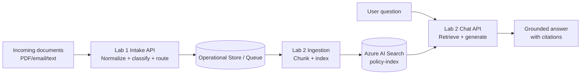

# Azure AI — One Day Workshop (09:00–17:00)

Audience: Belgian technical professionals with **some Azure**.

## Start here (choose one path)
- **Live class delivery (recommended):** `docs/CLASS_FAST_PATH.md`
- **Student canonical reproducible path (Windows, end-to-end):** `docs/STUDENT_REPRO_PLAYBOOK.md`
- **Self-serve full setup:** `infra/RESOURCE_SETUP.md` + `infra/iac/README.md`
- **Deterministic Lab 1 reproduction path (Windows):** `docs/REPRODUCIBLE_PATH.md`

## Course positioning (sales-ready)
See `docs/COURSE_POSITIONING.md` for headline, value propositions, audience fit, and outcomes.

## Access requirements (for IT/employer)
See `docs/ACCESS_REQUIREMENTS.md` for required Azure roles (instructor + students), RBAC prerequisites, and a copy-paste request template.

## Package contents
- `apps/demo-console/` — Streamlit GUI to demo Lab 1 + Lab 2 side-by-side
- `scripts/demo/generate_dataset.py` — synthetic GDPR-safe dataset generator
- `scripts/demo/run_pipeline.py` — batch Lab1->Lab2 ingestion pipeline
- `docs/DEMO_SCRIPT.md` — ready-to-use live demo script
- `docs/DAY_PLAN.md` — minute-by-minute schedule + learning objectives
- `docs/TRAINER_NOTES.md` — facilitation notes, checkpoints, recovery plans
- `docs/THEORY_GUIDE.md` — companion theory notes aligned with labs
- `docs/SLIDES.md` — markdown slide deck (`---` separators) with image/screenshot suggestions
- `docs/CLASS_FAST_PATH.md` — canonical in-class flow (lowest confusion path)
- `docs/COMMAND_CARDS.md` — concise command + concept + checkpoint cards for live teaching
- `docs/samples/` — GDPR-safe sample documents + PDF build pipeline
- `labs/lab1-intake-assistant/LAB.md` — Lab 1 manual (Document → JSON → workflow)
- `labs/lab2-rag-policy-bot/LAB.md` — Lab 2 manual (RAG bot with citations)
- `infra/` — infra notes + az cli snippets
- `infra/iac/` — participant environment IaC starter (deploy + cleanup scripts)

## What this project does (30 seconds)
You build two connected Azure AI patterns:
1) **Lab 1 — Intake Assistant:** turns messy document text into structured JSON (`doc_type`, `entities`, `summary`, `routing`) so it can drive workflows.
2) **Lab 2 — RAG Policy Bot:** answers questions over internal docs with citations.

How they connect:
- Lab 1 produces structured outputs and operational context.
- Lab 2 provides grounded Q&A over policy/knowledge documents.
- Together they form an intake + decision-support pipeline.

## Guardrails (GDPR-safe)
- Use **sample documents** only (no PII)
- Use **Key Vault** for secrets
- Prefer **Managed Identity** from Azure Web App
- Log safely (no prompts with secrets/PII)

## Participant quickstart (fresh Windows VM)
Use this flow for each participant machine:

1. **Install Git (winget):**
   - Open PowerShell **as Administrator**
   - Run: `winget install --id Git.Git --exact --source winget --silent --accept-source-agreements --accept-package-agreements`
   - If source certificate issues appear, run: `winget source reset --force` and retry.
2. **Clone repo:**
   - `git clone https://github.com/lennertvhoy/azure-ai-one-day-workshop.git`
   - `cd azure-ai-one-day-workshop`
3. **Run setup launcher:**
   - `powershell -ExecutionPolicy Bypass -File .\scripts\setup\setup-all.ps1`
   - Choose **1) Windows native**
4. **Verify environment again (optional but recommended):**
   - Re-run launcher and choose **3) Verify only (Windows)**

Troubleshooting:
- If `python` or `az` is not recognized right after install, close PowerShell and open a new **Administrator** PowerShell, then run verify again.

## Setup scripts (Windows + WSL)
- Interactive launcher (choose Windows/WSL/verify):
  - `powershell -ExecutionPolicy Bypass -File .\scripts\setup\setup-all.ps1`
- Windows clean install:
  - `powershell -ExecutionPolicy Bypass -File .\scripts\setup\windows\install.ps1`
  - Verify: `powershell -ExecutionPolicy Bypass -File .\scripts\setup\windows\verify.ps1`
- WSL setup:
  - `bash scripts/setup/wsl/install_wsl.sh`
  - Verify: `bash scripts/setup/wsl/verify_wsl.sh`
