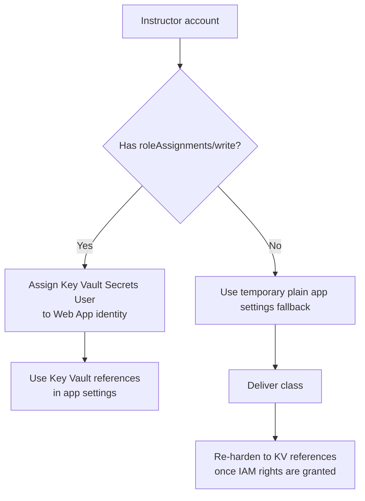

# Access Requirements (Instructor + Students)

Use this document when requesting Azure access for workshop delivery.

## Why this matters
Lab deployment uses managed identities and Key Vault secret references. That requires creating RBAC role assignments (e.g., Web App identity -> Key Vault Secrets User). If `roleAssignments/write` is missing, labs block on deployment hardening.

---

## Instructor access (required)

Choose one model:

### Option A — Recommended (simple)
- **Owner** on training Resource Group (or subscription)

### Option B — Practical least-privilege
- **Contributor** on training Resource Group (or subscription)
- **User Access Administrator** on the same scope

Without **User Access Administrator** (or Owner), you cannot assign RBAC roles to managed identities.

---

## Student access (recommended)

If students create resources themselves:
- **Contributor** on their assigned Resource Group

If student flow includes assigning managed identity roles:
- also grant **User Access Administrator**

Alternative: pre-provision role assignments via IaC/admin before class.

---

## RBAC operation required by labs

Instructor (or automation principal) must be able to perform:
- `Microsoft.Authorization/roleAssignments/write`

Typical assignment in labs:
- Principal: Web App managed identity
- Role: **Key Vault Secrets User**
- Scope: training Key Vault

---

## Copy-paste request for IT / employer

> Please grant my workshop instructor account either:
> - **Owner** on the training subscription/resource groups, OR
> - **Contributor + User Access Administrator** on the same scope.
>
> The Azure AI workshop labs require creating resources (App Service, Key Vault, Azure AI Search/OpenAI) and assigning managed identity access (Key Vault Secrets User), which requires `Microsoft.Authorization/roleAssignments/write`.

---

## Operational note for course reliability

If IAM grant rights are unavailable during a live class, use temporary fallback:
- set plain app settings directly from Key Vault secret values
- continue lab flow
- re-harden to Key Vault references once RBAC rights are granted
