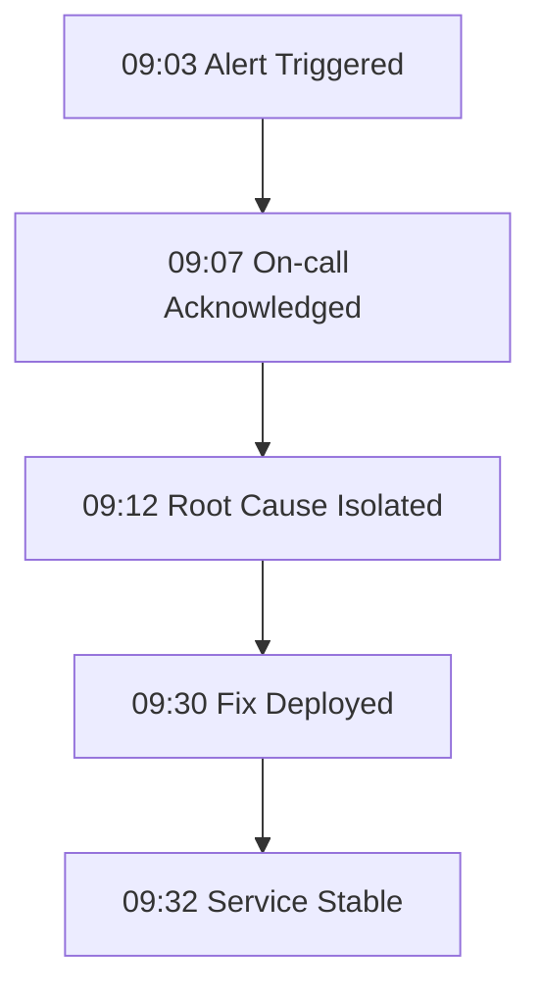

# Incident Report IR-001

Incident ID: IR-001
Date: 2026-02-08
System: Customer Portal API
Severity: High

## Summary
Users experienced intermittent 500 errors for 27 minutes.

## Timeline

## Root Cause
A stale cache key mapping caused invalid downstream routing.

## Corrective Actions
- Add cache key schema validation
- Add synthetic health probes
- Update rollback runbook